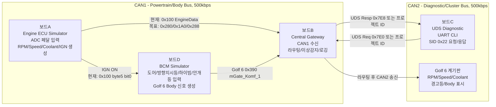
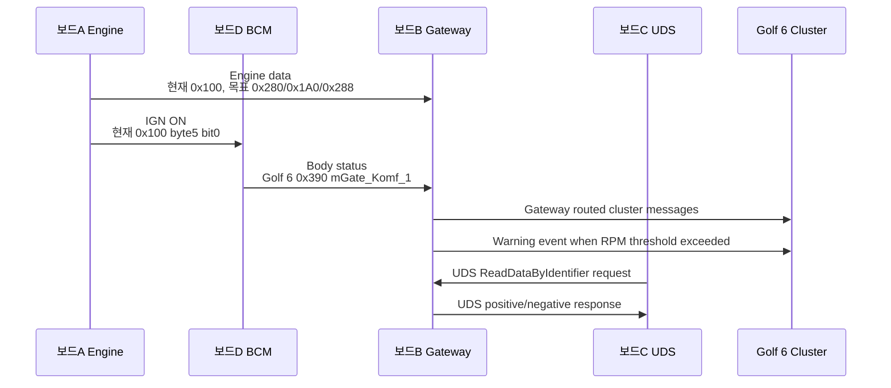

# CAN Gateway & UDS Diagnostic System

STM32F429ZI 기반 4개 ECU 보드와 Volkswagen Golf 6 계기판을 CAN으로 연결하는 교육용 프로젝트입니다.

목표는 보드 A가 엔진 데이터를 만들고, 보드 D가 BCM/Body 데이터를 만들며, 보드 B가 Central Gateway로 CAN1과 CAN2를 중계하고, 보드 C가 UDS 진단 요청을 주고받는 구조입니다.

현재 실차 기준 DBC는 [docs/Golf_6_PQ35.dbc](docs/Golf_6_PQ35.dbc)를 사용합니다.

---

## 시스템 아키텍처

```text
[보드A - 엔진 ECU 시뮬 + 페달 입력]   [보드D - BCM / Body Control Module]
  가변저항(액셀/브레이크)              Body CAN 신호 생성 및 주기 송신
  -> RPM, Speed, Coolant 주기 송신     Golf 6 0x390 방향지시등 L/R, 도어, 하이빔, 안개등
  사용자가 돌리면 RPM 실시간 변화     DIP 스위치 4개 -> FL/FR/RL/RR 도어 상태
  IGN ON 신호 송신                    모멘터리 버튼 -> 클러스터 화살표 점멸
                                     Engine ECU의 IGN ON 수신 후 Body 신호 송신 시작
          |                                                  |
==========|================ CAN1 (Powertrain/Body, 500kbps) =|==============
          |
[보드B - Central Gateway]
  CAN1 수신 -> 라우팅 테이블 -> CAN2 포워딩
  이상 감지: RPM 초과 시 경고 메시지 CAN2 송신
  버스 통계 UART 출력 (트래픽 로거)
  보드A/보드D 메시지 수신 및 필요 시 전달
          |
==========|================ CAN2 (Diagnostic/Cluster, 500kbps) =============
          |                                                  |
[보드C - UDS 진단 서버]                      [Volkswagen Golf 6 계기판]
  SID 0x22 응답                               RPM 바늘 추종
  VIN / RPM / Speed DID                       속도 바늘 추종
  UART CLI <- PC                              냉각수 온도
  NRC 처리                                    경고등 ON/OFF
                                            방향지시등 / 도어 / 하이빔 / 안개등 표시
```



---

## CAN 메시지 흐름



**메시지를 주고받는 기준**

- CAN1은 보드 A, 보드 B, 보드 D가 같이 물리는 Powertrain/Body 버스입니다.
- CAN2는 보드 B, 보드 C, Golf 6 계기판이 물리는 Diagnostic/Cluster 버스입니다.
- 보드 A와 보드 D는 직접 CAN2로 가지 않고, 보드 B가 필요한 메시지만 CAN2로 넘겨야 합니다.
- 보드 D는 IGN ON을 받은 뒤 Body 메시지를 송신합니다. 현재는 보드 A의 `0x100 byte5 bit0`을 IGN으로 사용하고, Golf 6식 `0x570/0x572 byte0 bit1` Klemme 15도 받을 수 있게 되어 있습니다.
- 계기판을 실제로 움직이려면 보드 B가 Golf 6 DBC 메시지를 CAN2로 보내야 합니다.

---

## 팀 구성 및 역할 분담

| 역할 | 담당자 | 주요 기능 | 주요 산출물 |
| --- | --- | --- | --- |
| **CAN 드라이버** | 성재, 민진 | CAN 통신을 위한 드라이버 | CAN 초기화, TX/RX 래퍼, Filter Bank |
| **엔진 ECU 시뮬레이터 (보드 A)** | 윤지 | ADC 입력 기반 차량 상태 생성 | 가변저항 입력 처리, RPM/Speed/Coolant 물리 모델링, CAN1 주기 송신, IGN ON 신호 생성 |
| **게이트웨이 라우팅 (보드 B)** | 지윤 | CAN 네트워크 중계 및 모니터링 | CAN1/CAN2 라우팅 테이블, 메시지 포워딩, UART 트래픽 로깅, RPM 초과 경고 |
| **UDS 진단 서버 (보드 C)** | 은빈, 민진 | 진단 프로토콜 처리 | UDS SID 0x22 핸들러, VIN/RPM/Speed DID 응답, NRC 처리, UART CLI |
| **BCM 시뮬레이터 (보드 D)** | 한결 | 차량 바디 시스템 입력 처리 | DIP 스위치 도어 입력, 방향지시등 버튼 입력, IGN ON 기반 동작 제어, Golf 6 Body CAN 송신 |
| **실차 계기판** | 성재, 은빈 | 실제 차량 계기판 연동 | Volkswagen Golf 6 계기판 CAN 메시지 파싱, RPM/속도 게이지 제어, 도어/경고등 표시 |

---

## 보드 구성

| 보드 | 모델 | 역할 | CAN 포트 |
| --- | --- | --- | --- |
| 보드A | STM32 F429ZI | 엔진 ECU 시뮬 + 페달 입력 | CAN1 |
| 보드B | STM32 F429ZI | Central Gateway | CAN1 + CAN2 |
| 보드C | STM32 F429ZI | UDS 진단 서버 | CAN1, Gateway CAN2 진단 버스에 물림 |
| 보드D | STM32 F429ZI | BCM Simulator | CAN1 |
| 계기판 | Volkswagen Golf 6 | 계기판 출력 | CAN |

---

## 현재 구현된 부분

| 영역 | 현재 상태 |
|---|---|
| 공통 CAN BSP | `common/can_bsp.c/h`에 CAN 초기화, TX/RX, RX Queue, Filter 설정이 구현되어 있음 |
| 보드 A Engine | ADC 기반 throttle/brake, RPM/Speed/Coolant 모델, `0x100` EngineData 50ms 송신, IGN bit 포함 |
| 보드 B Gateway | CAN1/CAN2 BSP 초기화, CAN RX Queue, `0x100` 수신 후 CAN2 포워딩 로직, RPM threshold warning flag, UART 통계 출력 |
| 보드 C UDS | UART CLI, SID `0x22` ReadDataByIdentifier 요청/응답 흐름 일부 구현 |
| 보드 D BCM | GPIO 입력, IGN 수신, IGN ON 이후 Body 송신, Golf 6 `0x390 mGate_Komf_1` 패킹 구현 |
| 문서/DBC | Golf 6 DBC 포함, 프로젝트 CAN DB 문서 일부 존재 |

---

## 추가 구현해야 할 부분

| 우선순위 | 작업 | 이유 |
|---:|---|---|
| 1 | 보드 B FreeRTOS 태스크 엔트리 확인 | CubeMX 생성 코드는 `StartTask02`를 실행하는데, 앱 코드는 `GatewayTask`로 구현되어 있으면 라우팅 태스크가 실제로 안 돌 수 있음 |
| 1 | 보드 B 라우팅 테이블 확장 | 현재 `0x100`만 처리하므로 보드 D의 `0x390`과 Golf 6 엔진/속도/냉각수 메시지를 CAN2로 넘겨야 함 |
| 1 | UDS CAN ID 통일 | 보드 B/A는 `0x7E0/0x7E8`, 보드 C/common은 `0x714/0x77E`가 섞여 있음. Golf 6/OBD 기준이면 `0x7E0/0x7E8`로 통일 권장 |
| 2 | 보드 A 송신 포맷을 Golf 6 DBC로 전환 | 현재는 내부 통합용 `0x100` 한 프레임에 RPM/Speed/Coolant/IGN을 묶음. 계기판 기준은 `0x280`, `0x1A0`, `0x288` |
| 2 | 보드 B 경고 메시지 실송신 | 현재 warning flag는 있으나 계기판용 경고 CAN 프레임 송신 로직은 별도 구현 필요 |
| 2 | 보드 C를 CAN2 진단 버스 기준으로 배치 | Gateway와 진단 요청/응답을 주고받으려면 물리 연결과 필터가 같은 ID 기준이어야 함 |
| 3 | CAN monitor 기반 통합 테스트 | CAN1에서 A/D 메시지 확인, CAN2에서 Gateway 포워딩 메시지 확인 |
| 3 | 문서와 코드 ID 정리 | `common/protocol_ids.h`, 보드별 `protocol_ids.h`, README, `docs/can_db.md`를 같은 기준으로 맞춰야 함 |

---

## 프로젝트 CAN DB 요약

### 현재 코드 기준

| ID | DLC | 송신 | 수신 | 주기 | 내용 |
|---:|---:|---|---|---:|---|
| `0x100` | 8 | 보드 A | 보드 B, 보드 D | 50ms | 프로젝트 내부 EngineData: RPM, Speed, Coolant, IGN, alive |
| `0x390` | 8 | 보드 D | 보드 B 또는 CAN monitor | 100ms | Golf 6 `mGate_Komf_1`: Body/BCM 상태 |
| `0x480` | 8 | 보드 B | 계기판 | 이벤트 | 프로젝트 경고 메시지, RPM 초과 등 |
| `0x7E0` | 8 | 보드 C | 보드 B | 이벤트 | UDS request 후보, Golf 6/OBD 표준 요청 ID |
| `0x7E8` | 8 | 보드 B | 보드 C | 이벤트 | UDS response 후보, Golf 6/OBD 표준 응답 ID |
| `0x714` | 8 | 보드 C | 보드 B | 이벤트 | 기존 프로젝트 UDS request ID, 일부 코드/common 기준 |
| `0x77E` | 8 | 보드 B | 보드 C | 이벤트 | 기존 프로젝트 UDS response ID, 일부 코드/common 기준 |

`0x7E0/0x7E8`과 `0x714/0x77E`는 둘 중 하나로 반드시 통일해야 합니다.

### Golf 6 DBC에서 필요한 최소 메시지

| Golf 6 ID | DBC 메시지 | 송신 담당 | 주요 Signal | 인코딩 |
|---:|---|---|---|---|
| `0x280` | `mMotor_1` | 보드 A 또는 보드 B | `MO1_Drehzahl` | start 16, len 16, little-endian, scale 0.25 |
| `0x1A0` | `mBremse_1` | 보드 A 또는 보드 B | `BR1_Rad_kmh` | start 17, len 15, little-endian, scale 0.01 |
| `0x288` | `mMotor_2` | 보드 A 또는 보드 B | `MO2_Kuehlm_T` | start 8, len 8, scale 0.75, offset -48 |
| `0x390` | `mGate_Komf_1` | 보드 D | `GK1_Blinker_li`, `GK1_Blinker_re`, `GK1_Fernlicht`, `GK1_Nebel_ein`, `GK1_Sta_Tuerkont` | bitfield |
| `0x570` | `mBSG_Last` | 보드 A 또는 Gateway | `BSL_ZAS_Kl_15` | byte0 bit1 |
| `0x572` | `mZAS_1` | 보드 A 또는 Gateway | `ZA1_Klemme_15` | byte0 bit1 |
| `0x7E0` | `ISO_MO_01_Req` | 보드 C | UDS request | ISO-TP Single Frame |
| `0x7E8` | `ISO_MO_01_Resp` | 보드 B/타깃 | UDS response | ISO-TP Single Frame |

### 보드 A 현재 `0x100` Payload

| Byte | 내용 |
|---:|---|
| 0-1 | RPM, uint16 little-endian |
| 2-3 | Speed, uint16 little-endian |
| 4 | Coolant, uint8 |
| 5 bit0 | IGN ON |
| 5 bit1-7 | Alive counter |
| 6-7 | Reserved |

### 보드 D Golf 6 `0x390 mGate_Komf_1` Payload

| Signal | Bit | 입력 |
|---|---:|---|
| `GK1_Sta_Tuerkont` | 4 | any door open |
| `GK1_Fa_Tuerkont` | 16 | any door open |
| `GK1_Blinker_li` | 34 | left turn blink |
| `GK1_Blinker_re` | 35 | right turn blink |
| `GK1_LS1_Fernlicht` | 37 | high beam |
| `GK1_Fernlicht` | 49 | high beam |
| `GK1_Nebel_ein` | 58 | fog light |

---

## CAN 통신 배선 및 테스트

### 물리 연결

- CAN1: 보드 A CAN1, 보드 B CAN1, 보드 D CAN1을 같은 버스에 연결합니다.
- CAN2: 보드 B CAN2, 보드 C, Golf 6 계기판을 같은 버스에 연결합니다.
- CANH는 CANH끼리, CANL은 CANL끼리, GND는 공통으로 연결합니다.
- 각 CAN 버스 양 끝에만 120옴 종단저항을 둡니다.
- Bitrate는 500kbps를 기준으로 맞춥니다.

### 통합 확인 순서

1. 보드 A만 켜고 CAN1에서 `0x100`이 50ms마다 나오는지 확인합니다.
2. 보드 D를 연결하고 `0x100 byte5 bit0 = 1`을 받은 뒤 CAN1에서 `0x390`이 100ms마다 나오는지 확인합니다.
3. 보드 D 입력 스위치를 바꾸면서 `0x390`의 bit가 바뀌는지 확인합니다.
4. 보드 B를 연결하고 CAN1 RX count가 증가하는지 UART 로그로 확인합니다.
5. 보드 B 라우팅 구현 후 CAN2에서 `0x280`, `0x1A0`, `0x288`, `0x390`이 보이는지 확인합니다.
6. 보드 C에서 UDS request를 보내고, 보드 B 또는 진단 대상이 response를 돌려주는지 확인합니다.

---

## 폴더 구조

```text
can-gateway-uds/
├── common/                       # 공통 CAN/UART/CLI/protocol 정의
├── docs/                         # DBC, CAN DB, 아키텍처, 인터페이스 문서
├── firmware/
│   ├── board_a_engine/           # Engine ECU simulator
│   ├── board_b_gateway/          # Central Gateway
│   ├── board_c_uds/              # UDS diagnostic board
│   └── board_d_body/             # Body / BCM simulator
├── tests/
└── tools/
```

---

## 빌드

보드별 단위 빌드:

```bash
cmake --preset Debug --fresh -S firmware/board_a_engine
cmake --build firmware/board_a_engine/build/Debug --parallel

cmake --preset Debug --fresh -S firmware/board_b_gateway
cmake --build firmware/board_b_gateway/build/Debug --parallel

cmake --preset Debug --fresh -S firmware/board_c_uds
cmake --build firmware/board_c_uds/build/Debug --parallel

cmake --preset Debug --fresh -S firmware/board_d_body
cmake --build firmware/board_d_body/build/Debug --parallel
```

루트 통합 빌드:

```bash
cmake --preset Debug --fresh
cmake --build --preset Debug --parallel
```

---

## 참고 문서

- [Golf 6 PQ35 DBC](docs/Golf_6_PQ35.dbc)
- [CAN DB](docs/can_db.md)
- [시스템 아키텍처](docs/architecture.md)
- [인터페이스 스펙](docs/interface_spec.md)
- [UDS DID 매핑](docs/uds_did_map.md)

---

## License

Educational use only.
